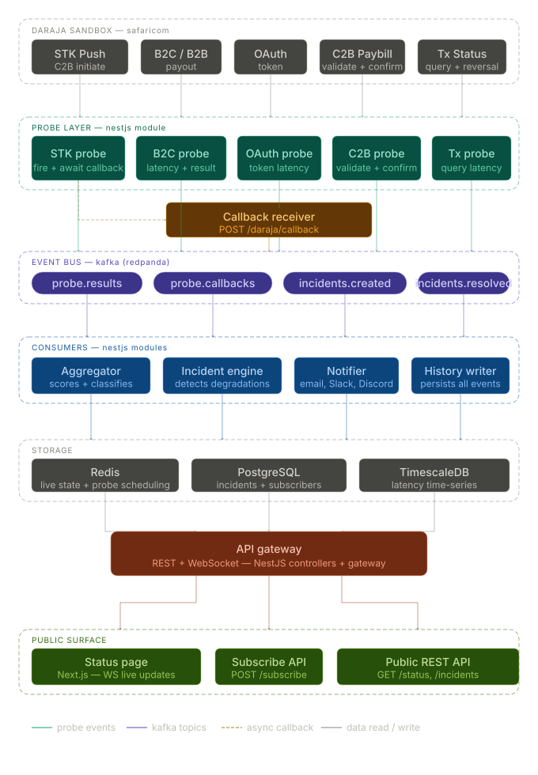

# Daraja Incident Status

A real-time incident monitoring system for the Safaricom Daraja M-Pesa API. Probes all major Daraja endpoints on a schedule, aggregates results through a Kafka event pipeline, automatically opens and resolves incidents, and fans out notifications to subscribers across multiple channels.


## System Overview



The system is composed of independent NestJS modules connected via Kafka topics and Redis pub/sub:

- **Probes** fire synthetic requests against all 7 Daraja API surfaces every 30 seconds
- **Aggregator** consumes probe results, maintains health scores, and opens/resolves incidents
- **Notifier** listens for incident events and dispatches alerts to all active subscribers
- **Status** serves a live summary over HTTP and pushes real-time updates over WebSocket
- **History** persists every Kafka event to TimescaleDB for time-series analysis


## Incident Flow



When a probe fails:

1. The probe publishes a `probe.result` event to Kafka with `status: failure`
2. The Aggregator increments the failure window for that service
3. Once failures reach the threshold (default: 3), an incident is opened in Postgres and a `incident.created` event is published
4. The affected service status is updated to `degraded_performance` or `major_outage` depending on severity
5. When a subsequent probe succeeds, the failure window resets, the incident is resolved, and a `incident.resolved` event is published
6. Redis pub/sub broadcasts both events to the WebSocket gateway for live UI updates


## Notification Fanout



Subscribers register once and receive alerts across any combination of channels:

- **Email** via SMTP
- **Slack** via incoming webhooks
- **Discord** via webhooks
- **Custom webhook** — any HTTP endpoint receives a structured JSON payload

Each notification attempt is recorded in Postgres with delivery status and any error detail.


## Highlights

**7 Daraja endpoints monitored**
STK Push, OAuth, C2B Paybill, B2C, Account Balance, Transaction Status, and Reversal — each probed independently so partial outages are visible at the service level.

**Event-driven pipeline**
Probes, aggregation, incident lifecycle, notifications, and history are all decoupled via Kafka. Each concern runs in its own consumer group and can be scaled independently.

**TimescaleDB for probe history**
`probe_results` and `event_log` are TimescaleDB hypertables — time-series queries over probe history are fast without manual partitioning.

**Real-time WebSocket updates**
The `/status` Socket.IO namespace broadcasts `status_update` events whenever an incident opens or resolves, so a frontend dashboard stays live without polling.

**Automatic incident lifecycle**
Incidents open and resolve automatically based on probe results — no manual intervention required. Failure threshold and probe interval are configurable via environment variables.

**Multi-channel notifications**
A single subscriber can receive alerts on all four channels simultaneously. The notifier fan-out is per-channel and each delivery is logged individually.

**Community telemetry via SDK**
Developers building on Daraja can install `daraja-monitor-sdk` to anonymously contribute real production failure data. Reports flow through the same Kafka aggregator pipeline and influence health scores alongside synthetic probes.


## API Documentation

Swagger UI is available at `/docs` when the server is running.

| Method | Path | Description |
|--------|------|-------------|
| `GET` | `/status` | System health summary for all services |
| `GET` | `/incidents` | List incidents (filter by service, status, severity) |
| `GET` | `/incidents/:id` | Incident detail with timeline updates |
| `POST` | `/subscribe` | Register a new subscriber |
| `DELETE` | `/subscribe/:id` | Deactivate a subscriber |
| `POST` | `/daraja/callback` | Daraja M-Pesa callback receiver |
| `POST` | `/telemetry` | Ingest anonymous failure report from SDK |


## Stack

| Layer | Technology |
|-------|-----------|
| Framework | NestJS 11, TypeScript |
| Database | PostgreSQL 16 + TimescaleDB |
| Message broker | Redpanda (Kafka-compatible) |
| Cache / pub-sub | Redis 7 |
| Query builder | Knex |
| Real-time | Socket.IO |
| Notifications | Nodemailer, Axios (Slack/Discord/webhook) |


## Local Setup

```bash
cp .env.example .env
# fill in your Daraja credentials and other values

docker compose up -d

npm install
npm run db:migrate
npm run db:seed

npm run start:dev
```


## Environment Variables

| Variable | Description |
|----------|-------------|
| `DARAJA_CONSUMER_KEY` | Daraja app consumer key |
| `DARAJA_CONSUMER_SECRET` | Daraja app consumer secret |
| `DARAJA_SHORTCODE` | Default business shortcode |
| `DARAJA_STK_SHORTCODE` | STK Push shortcode (Lipa Na M-Pesa) |
| `DARAJA_PASSKEY` | STK Push passkey |
| `DARAJA_CALLBACK_URL` | Publicly reachable HTTPS URL for Daraja callbacks |
| `PROBE_INTERVAL_SECONDS` | How often probes run (default: `30`) |
| `PROBE_FAILURE_THRESHOLD` | Consecutive failures before incident opens (default: `3`) |
| `PROBE_ENABLED` | Set to `false` to disable probing entirely |


## Community SDK

Developers building on Daraja can install [`daraja-monitor-sdk`](sdk/README.md) to anonymously contribute real production failure data to this system. Reports flow through the same aggregator pipeline and enrich health scores alongside synthetic probes.

See [`sdk/README.md`](sdk/README.md) for installation and usage.


## License

MIT
