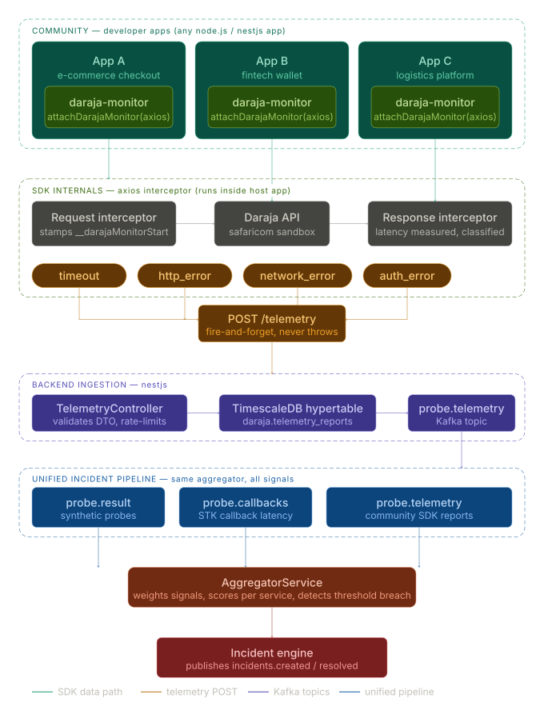

# daraja-monitor-sdk

A zero-config Axios interceptor that anonymously reports Daraja M-Pesa API failures to the community-driven [Safaricom Daraja Incident Status](https://github.com/victorpreston/daraja-incident-status) platform.



When your app encounters a Daraja timeout or HTTP error, the SDK silently forwards a lightweight, anonymous report to the central server. These reports are aggregated alongside synthetic probes to produce a more accurate, real-world picture of Daraja's health — powered by actual production traffic from across the ecosystem.

> **Privacy first.** No transaction data is ever collected. The SDK only sends: which endpoint failed, the error category, latency in milliseconds, and the Daraja environment (`sandbox` or `production`).

---

## Installation

```bash
npm install daraja-monitor-sdk
```

---

## Usage

### With a specific axios instance

```ts
import axios from 'axios';
import { attachDarajaMonitor } from 'daraja-monitor-sdk';

const darajaAxios = axios.create();

attachDarajaMonitor(darajaAxios, {
  serverUrl: 'https://your-daraja-status-server.com',
});

// All Daraja calls made via darajaAxios are now monitored
const response = await darajaAxios.post(
  'https://sandbox.safaricom.co.ke/mpesa/stkpush/v1/processrequest',
  payload,
  { headers },
);
```

### With the global axios instance

```ts
import axios from 'axios';
import { attachDarajaMonitor } from 'daraja-monitor-sdk';

attachDarajaMonitor(axios, {
  serverUrl: 'https://your-daraja-status-server.com',
});
```

### With NestJS (in bootstrap or a module)

```ts
import axios from 'axios';
import { attachDarajaMonitor } from 'daraja-monitor-sdk';

async function bootstrap() {
  const app = await NestFactory.create(AppModule);

  attachDarajaMonitor(axios, {
    serverUrl: process.env.DARAJA_MONITOR_URL,
  });

  await app.listen(3000);
}
```

---

## Options

| Option | Type | Required | Description |
|--------|------|----------|-------------|
| `serverUrl` | `string` | Yes | Base URL of the daraja-incident-status server |
| `apiKey` | `string` | No | Optional API key sent as `x-api-key` header |
| `enabled` | `boolean` | No | Set to `false` to disable reporting (e.g. in test environments) |

---

## What gets reported

When a call to a Safaricom endpoint fails, the SDK sends:

```json
{
  "endpoint": "stk-push",
  "errorType": "timeout",
  "latencyMs": 15032,
  "environment": "production",
  "sdkVersion": "1.0.0"
}
```

- **`endpoint`** — detected from the URL (e.g. `stk-push`, `b2c`, `oauth`)
- **`errorType`** — one of `timeout`, `http_error`, `network_error`, `auth_error`
- **`latencyMs`** — how long the request took before failing
- **`environment`** — `sandbox` or `production` based on the URL
- **`statusCode`** — included only for HTTP errors, omitted for timeouts

No phone numbers, amounts, transaction IDs, credentials, or any other sensitive data are collected.

---

## How it works

The SDK attaches an Axios request interceptor that:
1. Records the start time when a request to `*.safaricom.co.ke` is made
2. On error, classifies the failure type and measures latency
3. POSTs an anonymous report to `{serverUrl}/telemetry` with a 5-second timeout
4. **Never throws** — if the report fails to send, your app is completely unaffected

The central server stores the report and publishes it to a Kafka topic where the aggregator weighs it alongside synthetic probe results.

---

## License

MIT
